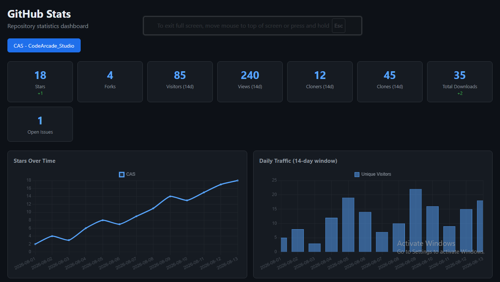
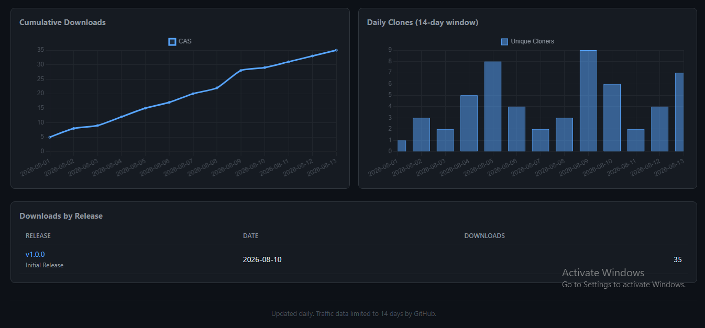

# 📊 GitHub Stats Dashboard
## 📌 Overview
**GitHub Stats Dashboard** is a dynamic web application and automated tracker built with **HTML, CSS, JavaScript, and Chart.js**. It tracks and visualizes live repository metrics—such as stars, forks, traffic (views/visitors), clones, downloads, and releases—providing a comprehensive analytics view inspired by modern developer dashboards.

---

## ✨ Features
* **Interactive Charts -** Powered by Chart.js to render trends like stars over time, daily traffic, and cumulative downloads with smooth visual lines and bar graphs.
* **Multi-Repo Management -** Clean tab-based navigation to easily switch and view statistics across different repositories.
* **Automated Data Collection -** Uses GitHub Actions to automatically fetch daily metrics via the GitHub REST API and update data logs.
* **Responsive Layout -** Built using CSS Grid and Flexbox for a clean, GitHub-inspired dark-mode aesthetic on both mobile and desktop devices.

---

## 🖼️ Preview
<p align="center">
  
  
</p>

---

## 🚀 Getting Started
1. Clone or download this repository.
2. Ensure the `data/` folder contains `current.json` and `history.json` files.
3. Open `index.html` using a local web server (like VS Code's **Live Server** extension) to view the live dashboard.

---

## 📂 Project Structure
```text
CodeArcade_Studio/
│
├── data/                 # Contains JSON data files (current.json, history.json)
├── scripts/              # Contains backend stats collector script (collect.js)
├── index.html            # Main frontend dashboard structure & charts
└── README.md             # Project documentation
```

---

## 🛠 Tech Stack
<div style="display: flex; flex-wrap: wrap; gap: 8px;">


</div>

---

## 📌 Future Enhancements
* **Custom Date Range Filter** - Allow users to filter analytics charts by custom date ranges (e.g., last 7 days, 30 days, year).
* **Export Data** - Add options to export stats summaries as CSV or PDF reports.
* **Webhook Alerts** - Trigger notifications when star milestones or significant traffic spikes occur.
