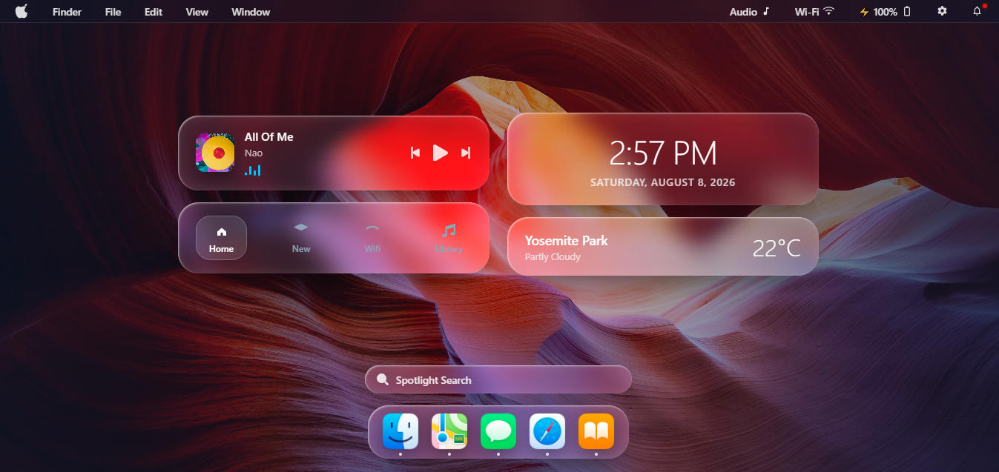

## 🖥️ macOS Glassmorphic Desktop Clone
## 📌 Overview
***macOS Glassmorphic Desktop Clone*** is a modern, high-end web-based desktop environment replicating the macOS aesthetic using advanced **Glassmorphism** design principles, fully interactive UI components, and vanilla JavaScript.

---

## ✨ Key Features

*   **macOS Top Menu Bar:** Features interactive dropdown menus, a real-time live clock, date display, and quick access panels.
*   **Interactive Dock:** Animated app launcher icons that dynamically trigger application windows and update titles.
*   **Floating Window Management:** A fully functional desktop window supporting **Open**, **Close**, **Minimize**, and **Maximize/Resize** actions.
*   **Spotlight Search Modal (`Ctrl/Cmd + Space`):** A lightning-fast app launcher with live filtering, keyboard navigation, and direct app execution.
*   **Control Center Toggles:** Interactive system toggles (Wi-Fi, Bluetooth, Dark Mode, etc.) with instant On/Off state updates.
*   **Notification Center & Mini Calendar:** Fully responsive notification cards paired with a dynamic calendar generator highlighting today's date and precise grid layouts.

---

## 🖼️ Preview

<p align="center">
  
</p>

---

## 🚀 Getting Started

1. Clone or download this repository.
2. Ensure you have an `Images/` folder in the root directory containing the relevant assets (logo, hero image, and product box images).
3. Open `Index.html` in your browser to view the interface.

---

## 📂 Project Structure

```text
macOS_Desktop_Clone/
│
├── Index.html        # Main HTML markup structure
├── style.css        # Glassmorphic styling & layout rules
└── script.js        # Interactive UI logic & window management
└── README.md         # Documentatio
```
---

## 🛠 Tech Stack

<div style="display: flex; flex-wrap: wrap; gap: 8px;">
  
  
  
  
  
</div>

---

## 📌 Future Enhancements

* **Multi-Window Support -** Ability to open multiple independent app windows simultaneously with dynamic z-index focus management.
* **Draggable Windows -** Allow users to click and drag window headers to reposition windows anywhere on the screen.
* **Working Audio Player -** Connect the music player widget to the actual HTML5 audio API with reactive visualizer bars.
* **Functional Mini-Apps -** Integrate fully working mini applications inside the windows (e.g., a Notepad, Customization Settings, and a Mini Browser).
* **Live Toast Notifications -** Trigger real-time floating pop-up notifications for system events and alerts.
