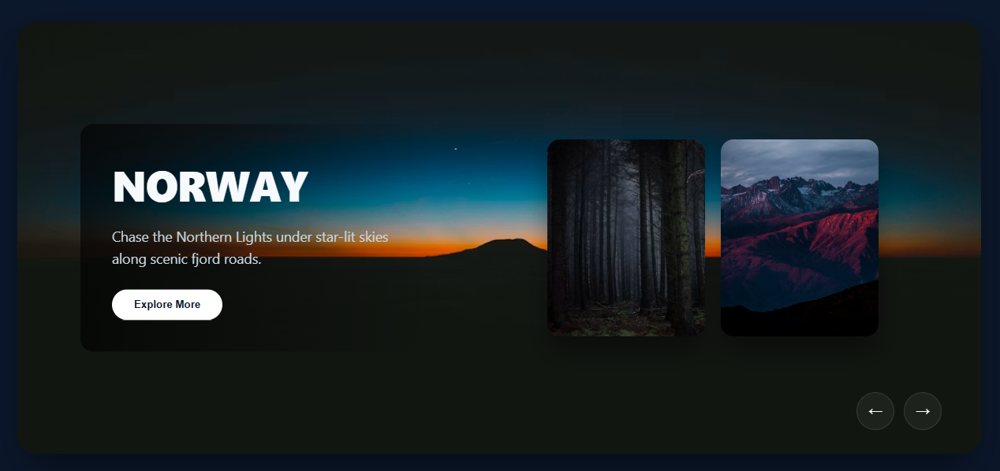

## 🌄 Modern Animated Image Slider 
## 📌 Overview
A sleek, modern, and fully responsive animated image slider featuring smooth transitions, background glassmorphism effects, and dynamic card rearrangement!

---

## ✨ Features

* **Modern Aesthetic:** Built with a dark slate theme, smooth card transitions, and glowing glassmorphism navigation buttons.
* **Smooth Animations:** Powered by CSS transitions and customized cubic-bezier curves for fluid slide movements.
* **Interactive Controls:** Seamless next and previous navigation with built-in safety to prevent animation spamming.
* **Dynamic Content Display:** Automatically reveals matching destination descriptions and stylized text animations as slides shift into focus.
* **Fully Responsive:** Adapts cleanly to different screen sizes using modern CSS functions like `min()` and `clamp()`.

---

## 🖼️ Preview

<p align="center">
  
</p>

---

## 🚀 Getting Started

1. Clone or download this repository.
2. Ensure your project structure matches the layout below.
3. Open `index.html` in any modern web browser to view the slider.

---

## 📂 Project Structure

```text
Animated-Image-Slider/
│
├── Images/           # Contains Images
├── Index.html        # Main HTML structure
├── Style.css         # Styling, layout, and keyframe animations
├── Script.js         # Interactive slider logic & event listeners
└── README.md         # Project documentation
```

---

## 🛠 Tech Stack

<div style="display: flex; flex-wrap: wrap; gap: 8px;">
  
  
  
  
  
</div>

---

## 📌 Future Enhancements

* **Autoplay with Pause on Hover -**
Add a timer (setInterval) so the slider automatically transitions to the next slide every few seconds.
Pause the autoplay when the user hovers over the slider or interacts with the navigation buttons.

* **Keyboard Navigation -**
Add event listeners for the ArrowLeft and ArrowRight keys so users can navigate the slider using their keyboard.

* **Thumbnail / Dot Indicators -**
Add clickable dot or thumbnail indicators at the bottom or side of the slider to let users jump directly to any specific slide.

* **Touch & Swipe Support (Mobile Friendly) -**
Implement touch event listeners (touchstart, touchend, etc.) or swipe gesture detection so mobile and tablet users can swipe left or right to change slides.

* **Dynamic Data Loading (JSON/API) -**
Move the slide data (titles, descriptions, background image URLs) into an external JSON file or fetch them from a travel API to make the code cleaner and easily scalable.

* **Sound Effects / Ambient Audio -**
Add subtle, ambient click sound effects on navigation or a toggleable background sound button to enhance the immersive travel vibe.
