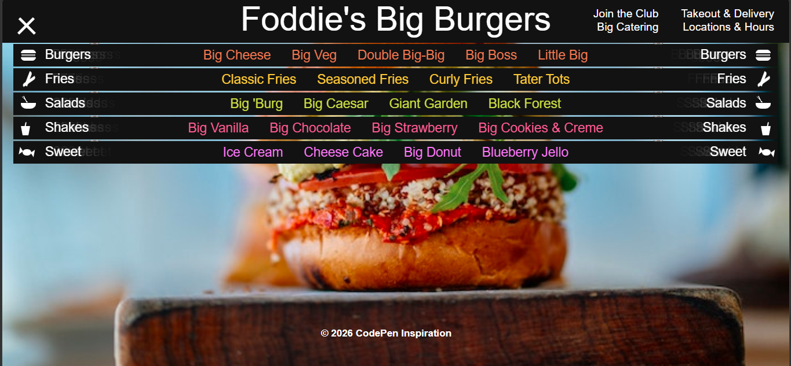

# 📜 Rollable Menu
## 📌 Overview
***Rollable Burger Menu*** is a unique, interactive, and beautifully animated inspired by classic scroll/paper roll mechanics. Built using pure HTML and advanced CSS 3D transforms, this project delivers a tactile, vintage restaurant menu experience directly on the web.

---

## ✨ Key Features

*   **3D Rollable Animation -** Implements CSS `perspective` and `rotateX` keyframe animations to give the menu a physical paper-roll opening and closing effect.
*   **Nested Structural Layout -** Cleverly utilizes nested container elements (`.part`) to cascade through multiple food categories (Burgers, Fries, Salads, Shakes, and Sweets).
*   **Custom CSS Vector Icons -** Features hand-crafted CSS shapes built via gradients, borders, and transforms to represent food items dynamically.
*   **Responsive Portrait/Landscape Modes -** Includes custom media queries to adapt the layout smoothly for mobile portrait and desktop landscape screens.

---

## 🖼️ Preview

<p align="center">
  
</p>

---

## 🚀 Getting Started

1. Clone or download this repository.
2. Ensure you have an `Images/` folder in the root directory containing the relevant assets (logo, hero image, and product box images).
3. Open `Index.html` in your browser to view the interface.

---

## 📂 Project Structure

```text
Rollable_Menu/
│
├── Images/          # Contain Images
├── index.html       # Main HTML structure containing nested menu parts
├── Style.css        # Core styling, 3D animations, and responsive media queries
└── README.md        # Project documentation
```
---

## 🛠 Tech Stack

<div style="display: flex; flex-wrap: wrap; gap: 8px;">
  
  
  
  
  
</div>
