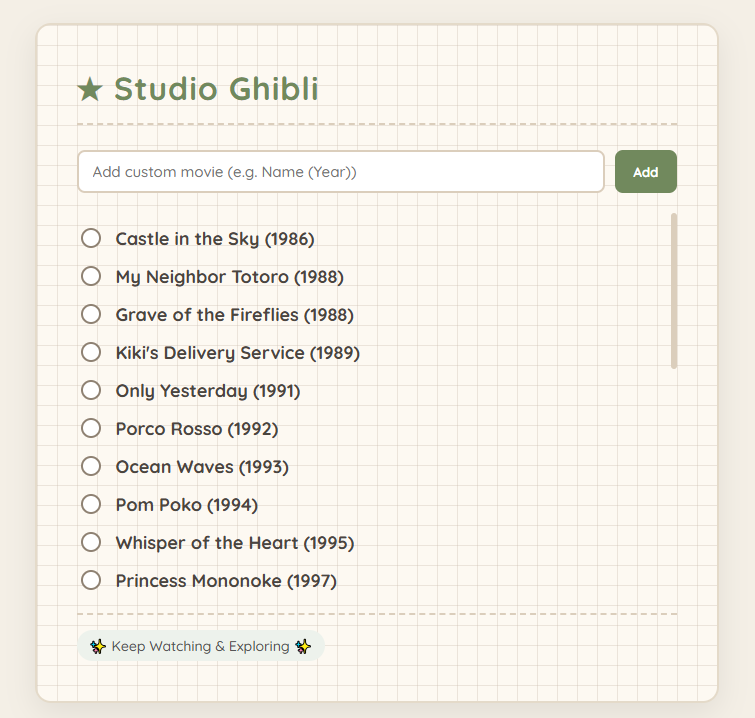

# 🌿 Studio Ghibli Movie list 
## 📌 Overview
***Studio Ghibli Movie List*** is a cozy, aesthetic, graph-paper style web application to keep track of your Studio Ghibli movie-watching journey! 

---

## ✨ Features

* Aesthetic Design: Features a warm cream color palette, grid paper background styled directly inside the card, and a handwritten-style font (`Quicksand`).
* Interactive Checklists: Click on any movie checkbox to check it off with a cute animated line-through effect.
* Static Movie List: Pre-loaded with all official Studio Ghibli feature films from *Castle in the Sky (1986)* to *The Boy and the Heron (2023)*.
* Custom Movie Adder: Includes an input section at the bottom so you can dynamically add new movies or specials to your list on the fly.
* Scrollable Interface: Designed with a smooth custom scrollbar to neatly contain the extensive list of films.

---

## 🖼️ Preview

<p align="center">
  
</p>

---

## 🚀 Getting Started

1. Clone or download this repository.
2. Ensure you have an `Images/` folder in the root directory containing the relevant assets (logo, hero image, and product box images).
3. Open `Index.html` in your browser to view the interface.

---

## 📂 Project Structure

```text
Studio Ghibli/
│
├── Images/           # Contains Images
├── Index.html        # Main structure of the site
├── style.css         # Main stylesheet, flex layouts, and component styling
└── README.md         # Project documentation
```

---

## 🛠 Tech Stack

<div style="display: flex; flex-wrap: wrap; gap: 8px;">
  
  
  
  
  
</div>
